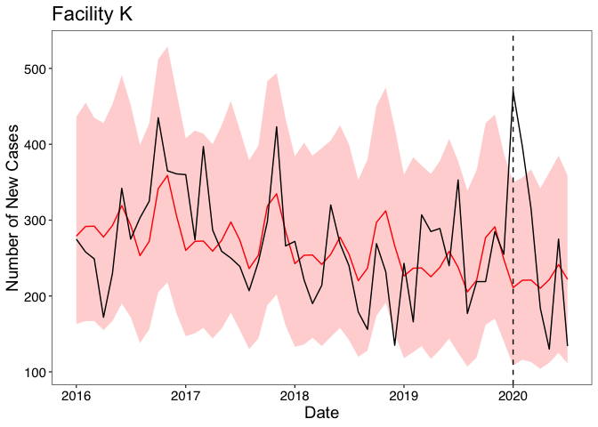
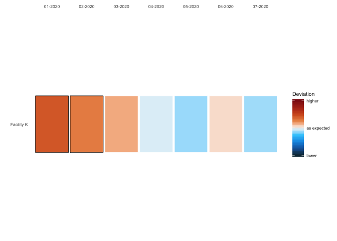
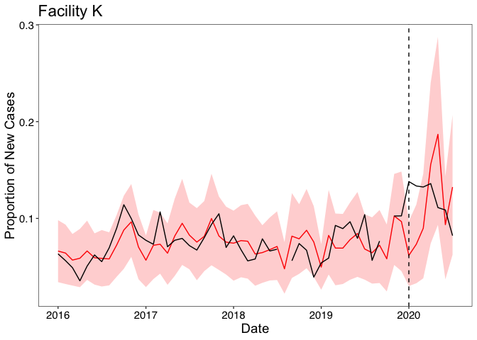
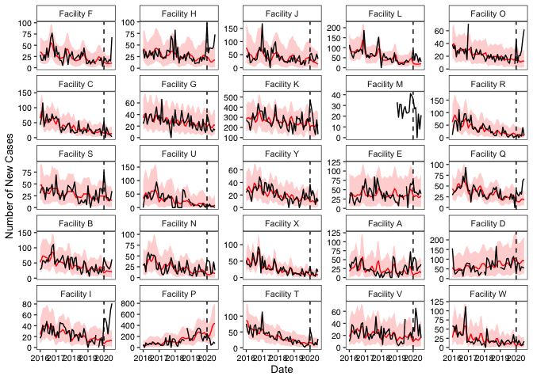
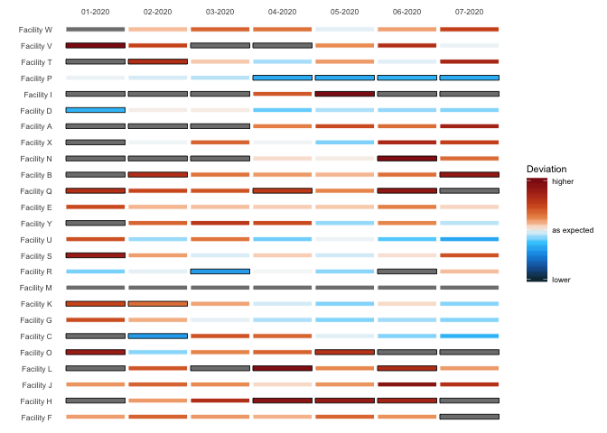
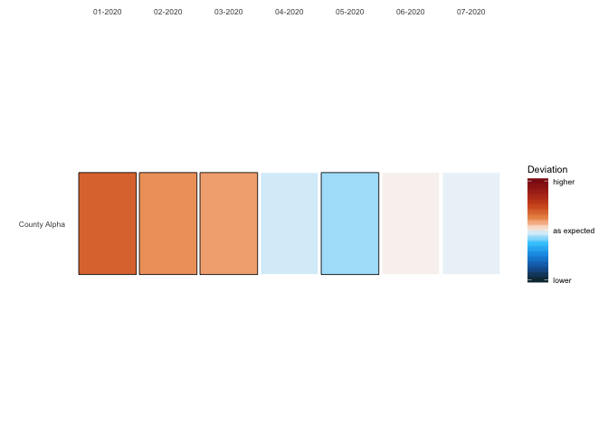
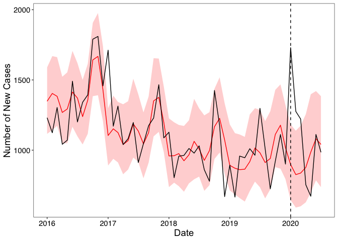

Global COVID-19 Response
========================

*Last updated: 29 January 2021*

Table of Contents
-----------------

-   [About](#About)
-   [Goals](#Goals)
-   [Modeling technique](#Modeling-technique)
    -   [Facility-level models](#Facility-level-models)
    -   [District and county-level
        models](#District-and-county-level-models)
    -   [Missing data considerations](#Missing-data-considerations)
-   [Overview of folders and files](#Overview-of-folders-and-files)
-   [Examples](#Examples)

About:
------

This repository contains code to follow the Data Processing Pipeline for
the Global Covid-19 Syndromic Surveillance Team - a partnership between
sites at Partners in Health, the Global Health Research Core at Harvard
Medical School, and Brigham and Women’s Hospital. The data has been
modified to respect the privacy of our sites, in hopes that other groups
can benefit from the functions we have written.

This repository contains data, code, and other items needed to reproduce
this work. Outputs include figures, tables, and Leaflet maps. Further
explanation of outputs and their construction is given in the “Overview
of folders and files” section, which includes detailed explanations of
the functions we have written.

Goals:
------

The main goal of the Global COVID-19 Syndromic Survillance Team is to
monitor changes in indicators that may signal changes in COVID-19 case
numbers in health systems from our eight partnering countries: Haiti,
Lesotho, Liberia, Malawi, Mexico, Peru, and Rwanda. This is accomplished
through establishing a baseline using prior data, and monitoring for
deviations for relevant indicators. The data visualization tools created
using our functions allow identification of local areas that are
experiencing upticks in COVID-19-related symptoms.

Modeling technique:
-------------------

The process starting with the raw data and finishing with the various
outputs is referred to as the Data Processing Pipeline (see Figure 1
below):

After data has been cleaned, it is processed according to the level it
is available at (either on a facility of county/district basis) for each
indicator. This is done by taking data from a historic baseline period,
and then projecting it into the evaluation period. This then is compared
to the observed counts/proportions. A 95% confidence interval has been
chosen, and we have defined the baseline period to be data from January
2016-December 2019.

The functions included in this repository focus on the modeling and
processing stages.

### Facility-level models:

For facility-level assessments, we fit a generalized linear model with
negative binomial distribution and log-link to estimate expected monthly
counts. Only data from the baseline period will be used to estimate the
expected counts: ![equation] (https://latex.codecogs.com/svg.latex?%5Clog%28E%5BY%20%7C%20year%2C%20t%20%5D%29%20%3D%20%5Cbeta_0%20&plus;%20%5Cbeta_1year%20&plus;%20%5Csum_%7Bk%3D1%7D%5E%7B3%7D%20%5Cbeta_%7Bk1%7D%20cos%282%20%5Cpi%20kt/12%29%20&plus;%20%5Cbeta_%7Bk2%7D%20sin%282%20%5Cpi%20kt/12%29)
where Y indicates monthly indicator count, t indicates the cumulative
month number. The year term captures trend, and the harmonic term
captures seasonality. This model is an adaptation of that proposed by
Dan Weinberger lab
(<a href="https://weinbergerlab.github.io/ExcessILI/articles/PImortality.html" class="uri">https://weinbergerlab.github.io/ExcessILI/articles/PImortality.html</a>).
If data is available on a more granular level, then weekly or daily
terms could be added to the equation to capture other types of trend. To
calculate the prediction intervals, we used ciTools R package
(<a href="https://cran.r-project.org/web/packages/ciTools/ciTools.pdf" class="uri">https://cran.r-project.org/web/packages/ciTools/ciTools.pdf</a>).

For proportions, in which the numerator is indicator counts and the
denominator is outpatient visits, we produced similar prediction
intervals using the following procedure: we performed a parametric
bootstrap procedure that generates random monthly indicator counts from
the prediction intervals described above and kept the total outpatient
visits fixed. This gives empirical estimates and prediction intervals
for proportions. If there were missing values for the monthly outpatient
visit count, instead of deleting those months and doing a complete-case
analysis which would waste existing indicator count data, we performed
an imputation procedure as follows: first, we fit the aforementioned
model for outpatient visits instead of indicator counts, and using that
model’s estimates, imputed the missing denominator values. Then, we can
do the parametric bootstrap procedure with the additional step of
randomly imputing missing denominator values in order to account for
variation and uncertainty in these imputed outpatient values.

### District and county-level models:

In Liberia, it was also of interest to perform syndromic surveillance at
the district and county-level. If there was no missing data, one could
simply sum the ARI counts across all facilities within a district (or
county) and fit the above model. However, the Liberia data contains
months with missing counts at the facility-level. We used a parametric
bootstrap to impute the missing values from the facility-level models in
the previous section. We drew realizations of the ARI counts for each
month and each facility and then summed these values for a district (or
county) level estimate. We repeated this procedure 500 times and took
the 2.5th and 97.5th percentiles to create 95% prediction intervals. For
region-level proportions, the number of outpatient visits can be summed
across facilities and a proportion can be computed. If there are missing
values in the outpatient visits, another step can be included in the
above parametric bootstrap procedure where missing outpatient visits are
generated from fitting the above model and where Y indicates monthly
outpatient visit count.

Alternatively, one could fit a generalized linear mixed model using the
above equation with a random effect terms for each facility within the
region. The region-level count estimates can then be obtained by
integrating over the random effects distribution. Ultimately, we did not
choose this model due to its lack of flexibility in dealing with missing
data.
$$ \\log(E\[Y\_j | year, t \]) = \\beta\_0 ^\* + \\beta\_1^\*year + \\sum\_{k=1}^{3} \\beta\_{k1}^\* cos(2 \\pi kt/12) + \\beta\_{k2}^\* sin(2 \\pi kt/12) + \\gamma \_{0j} $$

### Deviations and data visualizations:

We defined a deviation as the difference between the predicted and
observed count. To allow interpretation across facilities and regions of
different sizes, we divided by the predicted count for a scaled
deviation measure ((expected-observed)/expected), where positive values
mean that the observed number of acute respiratory infections is higher
than expected, potentially indicating circulation of COVID-19. In our
data visualizations, we report this scaled deviation measure in addition
to indicating if the observed count falls outside of the 95% prediction
interval. We provide 2 ways here to visualize the results: time series
plots and tiled heatmaps, with examples shown below.

### Missing data considerations:

We excluded facilities from our analysis for two reasons: (1) missing
dates in the baseline period (creation of the expected counts model) (2)
missing observed counts in the evaluation period.

For the first reason, facilities with high levels of missing data (more
than 20% of baseline dates missing) were excluded. Although there are
statistical methods that can handle missing time series data, we decided
to only include sites that demonstrated ability to collect data over
time. A complete case (time) analysis was conducted with included
facilities, which assumes that the counts were missing completely at
random (MCAR). Specifically, we assumed the reason for missing counts
was independent of time and count value. If the MCAR assumption was
violated and we had information about the missing data mechanism, one
could impute values for the missing data and report unbiased expected
counts and correct inference.

For the second reason, facilities with ANY missing monthly data during
the evaluation period (January 2020 onward) were removed. As the
syndromic surveillance exercise hinges on comparing the observed counts
to the expected and flagging for deviations, we require complete
observed data during this period. In this context, it would be invalid
to impute observed counts based on information from the baseline period.
In theory, one could attempt to impute the observed count based on
information during the evaluation period.

Overview of folders and files:
------------------------------

### Data

This folder contains example data used to demonstrate functions.
\#\#\#\# data.example\_singlecounty.rds The facility-level dataset used
to demonstrate the functions throughout this repository. Note- specific
names and numbers have been altered to respect the privacy of our sites.

### R

This folder contains the functions used to create the key data
visualization figures and maps.

### Figures

This folder contains figures that have been included in README.md.

Examples
--------

#### Loading Data and Functions

    source("R/model_functions.R")
    source("R/model_figures.R")

    data <- readRDS("data/data_example_singlecounty.rds")

    head(data)

    ## # A tibble: 6 x 10
    ##   date       county district facility indicator_count… indicator_count…
    ##   <date>     <chr>  <chr>    <chr>               <dbl>            <dbl>
    ## 1 2016-01-01 Count… Distric… Facilit…               29               15
    ## 2 2016-01-01 Count… Distric… Facilit…               40                7
    ## 3 2016-01-01 Count… Distric… Facilit…               46               13
    ## 4 2016-01-01 Count… Distric… Facilit…              114               32
    ## 5 2016-01-01 Count… Distric… Facilit…               38               17
    ## 6 2016-01-01 Count… Distric… Facilit…               43               17
    ## # … with 4 more variables: indicator_count_ari_over5 <dbl>,
    ## #   indicator_denom <dbl>, indicator_denom_under5 <dbl>,
    ## #   indicator_denom_over5 <dbl>

The data loaded here are taken from a county in Liberia and perturbed
slightly. The indicator of interest is acute respiratory infections,
disaggregated by age, and we also see total outpatient visits
(indicator\_denom)–a measure of healthcare utilization–disaggregated by
age.

#### Example 1: Single Facility

We take an example facility–“Facility K”, run the facility-specific
model, and look at the results through the counts and proportion lenses.

    # Declare this for all functions
    extrapolation_date <- "2020-01-01"

    # Run Facility-level Model
    example_1_results <- fit.site.specific.denom.pi(data=data,
                                  site_name="Facility K",
                                  extrapolation_date="2020-01-01",
                                  indicator_var="indicator_count_ari_total",
                                  denom_var="indicator_denom", 
                                  site_var="facility",
                                  date_var="date",
                                  R=500)

    head(example_1_results)

    ##         site       date est_raw_counts ci_raw_counts_low ci_raw_counts_up
    ## 1 Facility K 2016-01-01       282.6626               159              436
    ## 2 Facility K 2016-02-01       294.4013               171              449
    ## 3 Facility K 2016-03-01       294.5908               173              452
    ## 4 Facility K 2016-04-01       280.8624               162              436
    ## 5 Facility K 2016-05-01       296.5714               170              450
    ## 6 Facility K 2016-06-01       322.2265               193              486
    ##   observed   est_prop ci_low_prop ci_up_prop observed_prop
    ## 1      275 0.06627292  0.03416126 0.09819841    0.06340789
    ## 2      258 0.06421627  0.03223817 0.09361499    0.05638112
    ## 3      249 0.05696364  0.03061136 0.08394457    0.04912211
    ## 4      172 0.05886302  0.02894142 0.08918248    0.03553719
    ## 5      230 0.06637652  0.03648612 0.09771720    0.05070547
    ## 6      342 0.05935893  0.03160090 0.08458903    0.06226106

##### Single Facility Counts Results

    plot_heatmap(input = example_1_results)

**Note:** the black border boxes indicate statistical significance
(e.g. significantly higher than expected or significantly lower than
expected depending on the color)

    plot_site(input = example_1_results)

The observed count is given by the **black line** (raw data from DHIS2).
The expected (predicted) count is given by the **red
line** with 95% prediction intervals in light red (using the
model described above).

##### Single Facility Proportions Results

    plot_heatmap_prop(input = example_1_results)

**Note:** the black border boxes indicate statistical significance
(e.g. significantly higher than expected or significantly lower than
expected depending on the color)

    plot_site_prop(input = example_1_results)

The observed **proportion** is given by the **black line** (raw data
from DHIS2). The expected (predicted) proportion is given by the
**red line** with 95% prediction intervals in
light red (using the model described above).

#### Example 2: All Facilities

We repeat the process above for all indicators and all facilites. In
this example dataset, there are 25 facilites, 1 syndromic surveillance
indicator (ARI) and 1 denominator indicator (total denominator or
outpatient visits–a measure of healthcare utilization).

    #get all sites

    all_sites <- data %>% distinct(facility) %>% pull()

    # loop over all syndromic surveillance indicators and facilities

    lapply(c("indicator_count_ari_total"), function(y){    #can have a list of more indicators than just ARI
      
      do.call(rbind, lapply(all_sites,function(x)
          fit.site.specific.denom.pi(data=data,
                                  site_name=x,
                                  extrapolation_date=extrapolation_date,
                                  indicator_var=y,
                                  denom_var="indicator_denom",   #corresponding denominator indicator needed for proportions
                                  site_var="facility",
                                  date_var="date",
                                  R=500)))
      }
    ) -> facility.list

    names(facility.list) <- c("indicator_count_ari_total")

    head(facility.list[["indicator_count_ari_total"]])

    ##         site       date est_raw_counts ci_raw_counts_low ci_raw_counts_up
    ## 1 Facility F 2016-01-01       35.08931                11               72
    ## 2 Facility F 2016-02-01       33.22316                11               68
    ## 3 Facility F 2016-03-01       28.33952                 8               59
    ## 4 Facility F 2016-04-01       26.92792                 8               58
    ## 5 Facility F 2016-05-01       28.73480                 8               61
    ## 6 Facility F 2016-06-01       29.71428                 9               62
    ##   observed  est_prop ci_low_prop ci_up_prop observed_prop
    ## 1       29 0.1805420 0.037004157  0.3403291    0.14948454
    ## 2       17 0.1814612 0.024968374  0.3430393    0.09289617
    ## 3       16 0.1400292 0.005347779  0.2638585    0.07729469
    ## 4       29 0.1269664 0.014652346  0.2428888    0.13425926
    ## 5       17 0.1056909 0.009684995  0.1928747    0.06273063
    ## 6       44 0.1098465 0.013500311  0.2040849    0.16117216

We need to repeat the same process above but for the denominator
indicator variables. This is needed for the subsequent district-level
and county-level analyses because we use the facility-level estimates
for denominator to randomly impute, just as we randomly impute missing
syndromic surveillance indicator values using the code chunk above.

    # loop over all denominator(outpatient) indicators and facilities

    lapply(c("indicator_denom"), function(y){    #can have a list of more utilization indicators 

        do.call(rbind, lapply(all_sites,function(x)
          fit.site.specific.denom.pi(data=data,
                                     site_name=x,
                                     extrapolation_date=extrapolation_date,
                                     indicator_var=y,
                                     site_var="facility",
                                     date_var="date",
                                     counts_only=TRUE)))

    }) -> facility.list.denom

    names(facility.list.denom) <- c("indicator_denom")

    head(facility.list.denom[["indicator_denom"]])

    ##         site       date est_raw_counts ci_raw_counts_low ci_raw_counts_up
    ## 1 Facility F 2016-01-01       230.8190                56              516
    ## 2 Facility F 2016-02-01       232.6480                63              517
    ## 3 Facility F 2016-03-01       257.9420                73              555
    ## 4 Facility F 2016-04-01       270.6128                82              584
    ## 5 Facility F 2016-05-01       278.6836                85              578
    ## 6 Facility F 2016-06-01       321.8699               113              653
    ##   observed est_prop ci_low_prop ci_up_prop observed_prop
    ## 1      194       NA          NA         NA            NA
    ## 2      183       NA          NA         NA            NA
    ## 3      207       NA          NA         NA            NA
    ## 4      216       NA          NA         NA            NA
    ## 5      271       NA          NA         NA            NA
    ## 6      273       NA          NA         NA            NA

Below, we see results for ari counts for all facilities:

    plot_facet(input = facility.list[["indicator_count_ari_total"]])

The observed count is given by the **black line** (raw data from DHIS2).
The expected (predicted) count is given by the **red
line** with 95% prediction intervals in light red (using the
model described above).

#### Example 3: County-level

Now we run the county-level model for the ARI indicator. The same can of
course be done for the other indicators of interest.

    county_results <- fit.cluster.pi(data = data,
                               indicator_var = "indicator_count_ari_total",
                               denom_var = "indicator_denom",
                               site_var = "county",
                               date_var = "date",
                               denom_results_all = facility.list.denom, 
                               indicator_results_all= facility.list, 
                               counts_only=FALSE,
                               n_count_base = 0,
                               p_miss_base = 0.2,
                               p_miss_eval = 0.5,
                               R=250)

    head(county_results)

    ##         date est_raw_counts ci_raw_counts_low ci_raw_counts_up   est_prop
    ## 1 2016-01-01       1336.518          1106.722         1586.274 0.09753413
    ## 2 2016-02-01       1385.222          1136.514         1626.113 0.08053616
    ## 3 2016-03-01       1377.251          1105.911         1623.721 0.07478148
    ## 4 2016-04-01       1244.662          1053.027         1514.716 0.07056708
    ## 5 2016-05-01       1274.840          1031.150         1501.129 0.06707565
    ## 6 2016-06-01       1397.009          1129.152         1688.236 0.07655264
    ##   ci_low_prop ci_up_prop observed_count observed_denom observed_prop
    ## 1  0.08075026 0.11551426           1231       13732.35    0.08964236
    ## 2  0.06607642 0.09454144           1124       17200.00    0.06534884
    ## 3  0.06004838 0.08816426           1304       18417.00    0.07080415
    ## 4  0.05970220 0.08587798           1042       17638.00    0.05907699
    ## 5  0.05425391 0.07898186           1071       19006.00    0.05635063
    ## 6  0.06187474 0.09251116           1491       18249.00    0.08170311
    ##           site
    ## 1 County Alpha
    ## 2 County Alpha
    ## 3 County Alpha
    ## 4 County Alpha
    ## 5 County Alpha
    ## 6 County Alpha

    plot_heatmap_county(input = county_results)

**Note:** the black border boxes indicate statistical signficance
(e.g. significantly higher than expected or significantly lower than
expected depending on the color)

    plot_site_county(input = county_results)

The observed count is given by the **black line** (raw data from DHIS2).
The expected (predicted) count is given by the **red
line** with 95% prediction intervals in light red (using the
model described above).
