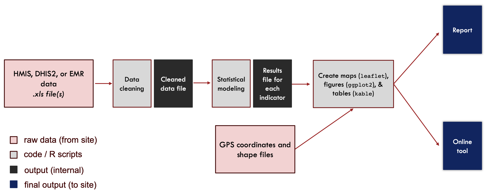
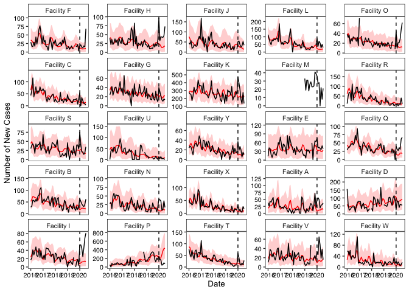
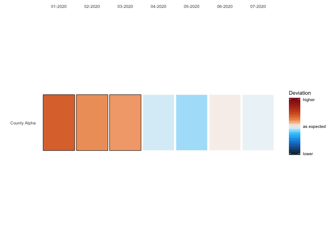
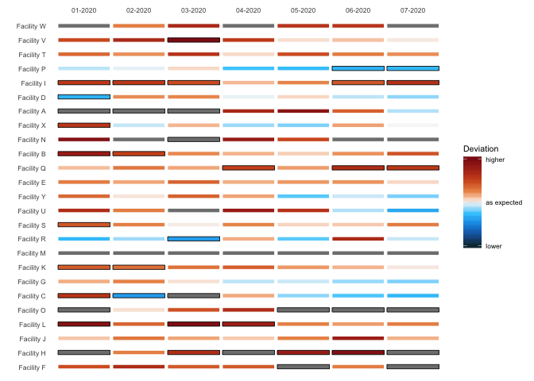
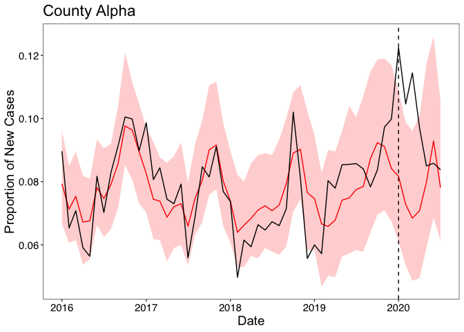

-   [Global COVID-19 Response](#global-covid-19-response)
    -   [Table of Contents](#table-of-contents)
    -   [About:](#about)
    -   [Goals:](#goals)
    -   [Modeling technique:](#modeling-technique)
        -   [Facility-level models:](#facility-level-models)
        -   [District and county-level
            models:](#district-and-county-level-models)
        -   [Deviations and data
            visualizations:](#deviations-and-data-visualizations)
        -   [Missing data considerations:](#missing-data-considerations)
    -   [Overview of folders and files:](#overview-of-folders-and-files)
        -   [Data](#data)
        -   [R](#r)
        -   [Figures](#figures)
    -   [Examples](#examples)
        -   [Loading Data and Functions](#loading-data-and-functions)
        -   [Example 1: Single Facility](#example-1-single-facility)
        -   [Example 2: All Facilities](#example-2-all-facilities)
        -   [Example 3: County-level](#example-3-county-level)

Global COVID-19 Response
========================

*Last updated: 29 January 2021*

Table of Contents
-----------------

-   [About](#About)
-   [Goals](#Goals)
-   [Modeling technique](#Modeling-technique)
    -   [Facility-level models](#Facility-level-models)
    -   [District and county-level
        models](#District-and-county-level-models)
    -   [Missing data considerations](#Missing-data-considerations)
-   [Overview of folders and files](#Overview-of-folders-and-files)
-   [Examples](#Examples)

About:
------

This repository contains code to follow the Data Processing Pipeline for
the Global Covid-19 Syndromic Surveillance Team - a partnership between
sites at Partners in Health, the Global Health Research Core at Harvard
Medical School, and Brigham and Women’s Hospital. The data has been
modified to respect the privacy of our sites, in hopes that other groups
can benefit from the functions we have written.

This repository contains data, code, and other items needed to reproduce
this work. Outputs include figures, tables, and Leaflet maps. Further
explanation of outputs and their construction is given in the “Overview
of folders and files” section, which includes detailed explanations of
the functions we have written.

Goals:
------

The main goal of the Global COVID-19 Syndromic Survillance Team is to
monitor changes in indicators that may signal changes in COVID-19 case
numbers in health systems from our eight partnering countries: Haiti,
Lesotho, Liberia, Malawi, Mexico, Peru, and Rwanda. This is accomplished
through establishing a baseline using prior data, and monitoring for
deviations for relevant indicators. The data visualization tools created
using our functions allow identification of local areas that are
experiencing upticks in COVID-19-related symptoms.

Modeling technique:
-------------------

The process starting with the raw data and finishing with the various
outputs is referred to as the Data Processing Pipeline (see Figure 1
below):

After data has been cleaned, it is processed according to the level it
is available at (either on a facility of county/district basis) for each
indicator. This is done by taking data from a historic baseline period,
and then projecting it into the evaluation period. This then is compared
to the observed counts/proportions. A 95% confidence interval has been
chosen, and we have defined the baseline period to be data from January
2016-December 2019.

The functions included in this repository focus on the modeling and
processing stages.

### Facility-level models:

For facility-level assessments, we fit a generalized linear model with
negative binomial distribution and log-link to estimate expected monthly
counts. Only data from the baseline period will be used to estimate the
expected counts:

where Y indicates monthly indicator count, t indicates the cumulative
month number. The year term captures trend, and the harmonic term
captures seasonality. This model is an adaptation of that proposed by
Dan Weinberger lab
(<a href="https://weinbergerlab.github.io/ExcessILI/articles/PImortality.html" class="uri">https://weinbergerlab.github.io/ExcessILI/articles/PImortality.html</a>).
If data is available on a more granular level, then weekly or daily
terms could be added to the equation to capture other types of trend. To
calculate the prediction intervals, we used ciTools R package
(<a href="https://cran.r-project.org/web/packages/ciTools/ciTools.pdf" class="uri">https://cran.r-project.org/web/packages/ciTools/ciTools.pdf</a>).

For proportions, in which the numerator is indicator counts and the
denominator is outpatient visits, we produced similar prediction
intervals using the following procedure: we performed a parametric
bootstrap procedure that generates random monthly indicator counts from
the prediction intervals described above and kept the total outpatient
visits fixed. This gives empirical estimates and prediction intervals
for proportions. If there were missing values for the monthly outpatient
visit count, instead of deleting those months and doing a complete-case
analysis which would waste existing indicator count data, we performed
an imputation procedure as follows: first, we fit the aforementioned
model for outpatient visits instead of indicator counts, and using that
model’s estimates, imputed the missing denominator values. Then, we can
do the parametric bootstrap procedure with the additional step of
randomly imputing missing denominator values in order to account for
variation and uncertainty in these imputed outpatient values.

### District and county-level models:

In Liberia, it was also of interest to perform syndromic surveillance at
the district and county-level. If there was no missing data, one could
simply sum the ARI counts across all facilities within a district (or
county) and fit the above model. However, the Liberia data contains
months with missing counts at the facility-level. We used a parametric
bootstrap to impute the missing values from the facility-level models in
the previous section. We drew realizations of the ARI counts for each
month and each facility and then summed these values for a district (or
county) level estimate. We repeated this procedure 500 times and took
the 2.5th and 97.5th percentiles to create 95% prediction intervals. For
region-level proportions, the number of outpatient visits can be summed
across facilities and a proportion can be computed. If there are missing
values in the outpatient visits, another step can be included in the
above parametric bootstrap procedure where missing outpatient visits are
generated from fitting the above model and where Y indicates monthly
outpatient visit count.

Alternatively, one could fit a generalized linear mixed model using the
above equation with a random effect terms for each facility within the
region. The region-level count estimates can then be obtained by
integrating over the random effects distribution. Ultimately, we did not
choose this model due to its lack of flexibility in dealing with missing
data.

### Deviations and data visualizations:

We defined a deviation as the difference between the predicted and
observed count. To allow interpretation across facilities and regions of
different sizes, we divided by the predicted count for a scaled
deviation measure ((expected-observed)/expected), where positive values
mean that the observed number of acute respiratory infections is higher
than expected, potentially indicating circulation of COVID-19. In our
data visualizations, we report this scaled deviation measure in addition
to indicating if the observed count falls outside of the 95% prediction
interval. We provide 2 ways here to visualize the results: time series
plots and tiled heatmaps, with examples shown below.

### Missing data considerations:

We excluded facilities from our analysis for two reasons: (1) missing
dates in the baseline period (creation of the expected counts model) (2)
missing observed counts in the evaluation period.

For the first reason, facilities with high levels of missing data (more
than 20% of baseline dates missing) were excluded. Although there are
statistical methods that can handle missing time series data, we decided
to only include sites that demonstrated ability to collect data over
time. A complete case (time) analysis was conducted with included
facilities, which assumes that the counts were missing completely at
random (MCAR). Specifically, we assumed the reason for missing counts
was independent of time and count value. If the MCAR assumption was
violated and we had information about the missing data mechanism, one
could impute values for the missing data and report unbiased expected
counts and correct inference.

For the second reason, facilities with ANY missing monthly data during
the evaluation period (January 2020 onward) were removed. As the
syndromic surveillance exercise hinges on comparing the observed counts
to the expected and flagging for deviations, we require complete
observed data during this period. In this context, it would be invalid
to impute observed counts based on information from the baseline period.
In theory, one could attempt to impute the observed count based on
information during the evaluation period.

Overview of folders and files:
------------------------------

### Data

This folder contains example data used to demonstrate functions.
\#\#\#\# data.example\_singlecounty.rds The facility-level dataset used
to demonstrate the functions throughout this repository. Note- specific
names and numbers have been altered to respect the privacy of our sites.

### R

This folder contains the functions used to create the key data
visualization figures and maps.

### Figures

This folder contains figures that have been included in README.md.

Examples
--------

#### Loading Data and Functions

    source("R/model_functions.R")
    source("R/model_figures.R")

    data <- readRDS("data/data_example_singlecounty.rds")

    head(data)

    ## # A tibble: 6 x 10
    ##   date       county district facility indicator_count… indicator_count…
    ##   <date>     <chr>  <chr>    <chr>               <dbl>            <dbl>
    ## 1 2016-01-01 Count… Distric… Facilit…               29               15
    ## 2 2016-01-01 Count… Distric… Facilit…               40                7
    ## 3 2016-01-01 Count… Distric… Facilit…               46               13
    ## 4 2016-01-01 Count… Distric… Facilit…              114               32
    ## 5 2016-01-01 Count… Distric… Facilit…               38               17
    ## 6 2016-01-01 Count… Distric… Facilit…               43               17
    ## # … with 4 more variables: indicator_count_ari_over5 <dbl>,
    ## #   indicator_denom <dbl>, indicator_denom_under5 <dbl>,
    ## #   indicator_denom_over5 <dbl>

The data loaded here are taken from a county in Liberia and perturbed
slightly. The indicator of interest is acute respiratory infections
(first column: indicqtor\_count\_ari\_total), disaggregated by age
(following 2 columns), and we also see total outpatient visits
(indicator\_denom)–a measure of healthcare utilization–disaggregated by
age.

#### Example 1: Single Facility

We take an example facility–“Facility K”, run the facility-specific
model for one specific indicator–“indicator\_count\_ari\_total”, with
the associated denominator–“indicator\_denom” and other parameter
specifications as seen below, and look at the results through the counts
and proportion lenses.

    # Declare this for all functions
    extrapolation_date <- "2020-01-01"

    # Run Facility-level Model
    example_1_results <- fit.site.specific.denom.pi(data=data,
                                  site_name="Facility K",
                                  extrapolation_date=extrapolation_date,
                                  indicator_var="indicator_count_ari_total",
                                  denom_var="indicator_denom", 
                                  site_var="facility",
                                  date_var="date",
                                  R=500)   # Number of Boostrap resamples

The dataframe *example\_1\_results* contains the following fields:
estimated counts, confidence intervals for counts, observed counts,
estimated proportions, confidence intervals for proportions, and
observed proportions.

    head(example_1_results)

    ##         site       date est_raw_counts ci_raw_counts_low ci_raw_counts_up
    ## 1 Facility K 2016-01-01       278.9518               163              436
    ## 2 Facility K 2016-02-01       291.6721               167              455
    ## 3 Facility K 2016-03-01       292.0675               167              435
    ## 4 Facility K 2016-04-01       277.7879               155              428
    ## 5 Facility K 2016-05-01       292.9597               167              453
    ## 6 Facility K 2016-06-01       319.0795               190              491
    ##   observed   est_prop ci_low_prop ci_up_prop observed_prop
    ## 1      275 0.06064100  0.03412497 0.09617247    0.06340789
    ## 2      258 0.06381119  0.03562063 0.10173186    0.05638112
    ## 3      249 0.06667982  0.03993391 0.09738114    0.04912211
    ## 4      172 0.06280992  0.03583161 0.09548554    0.03553719
    ## 5      230 0.06238977  0.03526235 0.09986772    0.05070547
    ## 6      342 0.06835973  0.04149827 0.10285818    0.06226106

We can view plots of the results for Facility K, for counts and for
proportions, by running the following function and passing in the
facility-specific model results dataframe as the first parameter and
either “count” or “proportion” as the second parameter.

##### Single Facility Counts Results

    plot_site(example_1_results,"count")

The observed count is given by the **black line** (raw data from DHIS2).
The expected (predicted) count is given by the **red
line** with 95% prediction intervals in light red (using the
model described above).

##### Single Facility Proportions Results

    plot_site(example_1_results, "proportion")

#### Example 2: All Facilities

We repeat the process above for all indicators and all facilities. In
this example dataset, there are 25 facilities, 1 syndromic surveillance
indicator (ARI) and 1 denominator indicator (total denominator or
outpatient visits–a measure of healthcare utilization). We provide code
below that can be adapted for more than 1 indicator.

    # get all sites

    all_sites <- data %>% distinct(facility) %>% pull()

    # loop over all syndromic surveillance indicators and facilities

    lapply(c("indicator_count_ari_total"), function(y){    # can have a list of more indicators than just ARI
      
      do.call(rbind, lapply(all_sites,function(x)
          fit.site.specific.denom.pi(data=data,
                                  site_name=x,
                                  extrapolation_date=extrapolation_date,
                                  indicator_var=y,
                                  denom_var="indicator_denom",   # corresponding denominator indicator needed for proportions
                                  site_var="facility",
                                  date_var="date",
                                  R=500)))
      }
    ) -> facility.list

    # label each dataframe in the output with the respective indicator names; note this example has only 1

    names(facility.list) <- c("indicator_count_ari_total")  

The dataframe *facility.list\[\[“indicator\_count\_ari\_total”\]\]*
contains, for each facility, the same fields as for a single facility:
estimated counts, confidence intervals for counts, observed counts,
estimated proportions, confidence intervals for proportions, and
observed proportions.

    head(facility.list[["indicator_count_ari_total"]])

    ##         site       date est_raw_counts ci_raw_counts_low ci_raw_counts_up
    ## 1 Facility F 2016-01-01       35.08931                13               70
    ## 2 Facility F 2016-02-01       33.22316                10               68
    ## 3 Facility F 2016-03-01       28.33952                 8               59
    ## 4 Facility F 2016-04-01       26.92792                 7               59
    ## 5 Facility F 2016-05-01       28.73480                 9               59
    ## 6 Facility F 2016-06-01       29.71428                 9               61
    ##   observed   est_prop ci_low_prop ci_up_prop observed_prop
    ## 1       29 0.13659794  0.04639175  0.2783505    0.14948454
    ## 2       17 0.13661202  0.04918033  0.2924863    0.09289617
    ## 3       16 0.10386473  0.03381643  0.2318841    0.07729469
    ## 4       29 0.09722222  0.02997685  0.2292824    0.13425926
    ## 5       17 0.09963100  0.03690037  0.2085793    0.06273063
    ## 6       44 0.09157509  0.02564103  0.2126374    0.16117216

We repeat the same process above but for the denominator indicator
variables. This is needed for the subsequent district-level and
county-level analyses, and it is implemented within those corresponding
functions, but we show this explicitly for demonstration’s sake (output
not directly used in subsequent examples). We need the following
facility-level estimates for denominator to randomly impute, just as we
randomly impute missing syndromic surveillance indicator values using
the facility-level model output from the code chunk above.

    # loop over all denominator(outpatient) indicators and facilities

    lapply(c("indicator_denom"), function(y){    # can have a list of more utilization indicators 

        do.call(rbind, lapply(all_sites,function(x)
          fit.site.specific.denom.pi(data=data,
                                     site_name=x,
                                     extrapolation_date=extrapolation_date,
                                     indicator_var=y,
                                     site_var="facility",
                                     date_var="date",
                                     counts_only=TRUE)))

    }) -> facility.list.denom

    names(facility.list.denom) <- c("indicator_denom")

    head(facility.list.denom[["indicator_denom"]])

    ##         site       date est_raw_counts ci_raw_counts_low ci_raw_counts_up
    ## 1 Facility F 2016-01-01       230.8190                57              534
    ## 2 Facility F 2016-02-01       232.6480                62              520
    ## 3 Facility F 2016-03-01       257.9420                68              578
    ## 4 Facility F 2016-04-01       270.6128                83              590
    ## 5 Facility F 2016-05-01       278.6836                86              580
    ## 6 Facility F 2016-06-01       321.8699               105              653
    ##   observed est_prop ci_low_prop ci_up_prop observed_prop
    ## 1      194       NA          NA         NA            NA
    ## 2      183       NA          NA         NA            NA
    ## 3      207       NA          NA         NA            NA
    ## 4      216       NA          NA         NA            NA
    ## 5      271       NA          NA         NA            NA
    ## 6      273       NA          NA         NA            NA

Below, we see results for ARI counts and proportions for all facilities:

    plot_facet(facility.list[["indicator_count_ari_total"]], "count")

The observed count is given by the **black line** (raw data from DHIS2).
The expected (predicted) count is given by the **red
line** with 95% prediction intervals in light red (using the
model described above).

    plot_facet(facility.list[["indicator_count_ari_total"]], "proportion")

Also useful are heatmaps, especially for comparison between the
different facilities using the deviation metric as described above.
Again, the first parameter in the function below is the model output,
and the second parameter is either “count” or “proportion”:

    plot_heatmap(facility.list[["indicator_count_ari_total"]],"count")

**Note:** the black border boxes indicate statistical significance
(e.g. significantly higher than expected or significantly lower than
expected depending on the color)

    plot_heatmap(facility.list[["indicator_count_ari_total"]],"proportion")

#### Example 3: County-level

Now we run the county-level model for the ARI indicator. The same can of
course be done for the other indicators of interest. Note that the
parameters we supply are mostly the same as for the facility-level
model, except now we have a few additional parameter specifications:
“counts\_only = FALSE”, which means run the model for counts and
proportions, “n\_count\_base = 0”, which means we want to filter for
facilities whose median indicator counts is greater than 0,
“p\_miss\_baseline”, which means we accept facilities with 20% of months
missing or fewer from the baseline period, and “p\_miss\_eval = 0.5”,
which means we accept facilities with 50% of months missing or fewer
from the evaluation period.

    county_results <- fit.cluster.pi(data = data,
                               indicator_var = "indicator_count_ari_total",
                               denom_var = "indicator_denom",
                               site_var = "facility",
                               date_var = "date",
                               counts_only=FALSE,
                               n_count_base = 0,
                               p_miss_base = 0.2,
                               p_miss_eval = 0.5,
                               R=250)   # Number of Bootstrap resamples)

    ## Note: Using an external vector in selections is ambiguous.
    ## ℹ Use `all_of(indicator)` instead of `indicator` to silence this message.
    ## ℹ See <https://tidyselect.r-lib.org/reference/faq-external-vector.html>.
    ## This message is displayed once per session.

The fields in the output are the same as for a facility-level model:
estimated counts, confidence intervals for counts, observed counts,
estimated proportions, confidence intervals for proportions, and
observed proportions.

    head(county_results)

    ##         date est_raw_counts ci_raw_counts_low ci_raw_counts_up   est_prop
    ## 1 2016-01-01         1348.5          1116.225         1589.550 0.07928928
    ## 2 2016-02-01         1404.0          1143.000         1669.775 0.07127907
    ## 3 2016-03-01         1383.5          1173.800         1662.550 0.07536515
    ## 4 2016-04-01         1268.5          1048.800         1522.875 0.06721284
    ## 5 2016-05-01         1293.5          1049.450         1554.275 0.06758392
    ## 6 2016-06-01         1414.0          1166.450         1707.000 0.07811387
    ##   ci_low_prop ci_up_prop observed observed_prop         site
    ## 1  0.06649585 0.09619876     1231    0.08964236 County Alpha
    ## 2  0.06057849 0.08503052     1124    0.06534884 County Alpha
    ## 3  0.06151382 0.08951784     1304    0.07080415 County Alpha
    ## 4  0.05379862 0.08189279     1042    0.05907699 County Alpha
    ## 5  0.05534568 0.08093891     1071    0.05635063 County Alpha
    ## 6  0.06631733 0.09336265     1491    0.08170311 County Alpha

We can view similar plots as for the facility-specific plots above but
now for the county of interest, using the same plotting function:

    plot_site(county_results, "count")

The observed count is given by the **black line** (raw data from DHIS2).
The expected (predicted) count is given by the **red
line** with 95% prediction intervals in light red (using the
model described above).

    plot_site(county_results,"proportion")

